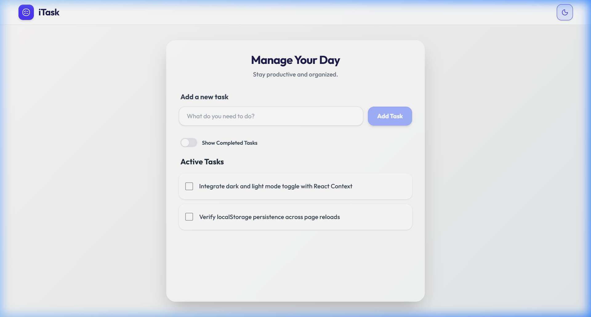
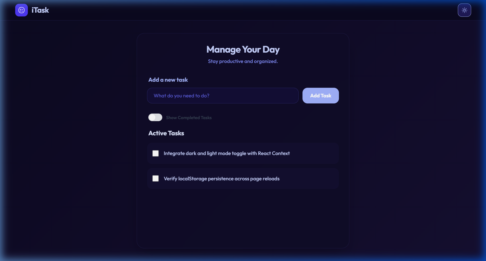

# 📝 iTask — Modern Todo App

A sleek, responsive, and component-driven Todo List application built with **React 19**, **Vite**, and **Tailwind CSS v4**. Features full **Dark/Light mode** support powered by React Context, smooth micro-interactions, task filtering, and persistent storage via `localStorage`.

---

## 📸 Screenshots

| ☀️ Light Mode | 🌙 Dark Mode |
| :---: | :---: |
|  |  |

---

## 🚀 Features

- **Quick Task Creation**: Add new tasks using the **Add Task** button or simply pressing the **Enter** key.
- **Input Validation**: Disallows empty or whitespace-only tasks to keep your list clean.
- **Task Completion Toggle**: Check off finished tasks with instant visual feedback and strikethrough styling.
- **Show / Hide Finished Tasks**: A toggle switch (`TodoFilter`) to easily hide completed tasks or view your full history.
- **Inline Editing**: Quickly edit any task to revise its details.
- **Task Deletion**: Remove individual tasks with a single click.
- **Persistent Storage**: All tasks are automatically saved to browser `localStorage` and persist across reloads.
- **Dark / Light Theme Toggle**: Seamless theme switching with animated Sun/Moon icons powered by React Context API and CSS custom properties; persists your theme preference.
- **Fully Responsive**: Optimized for seamless productivity across mobile, tablet, and desktop viewports.

---

## 🎨 Design System & Aesthetics

- **Typography**: Clean, modern typography using [Outfit](https://fonts.google.com/specimen/Outfit) from Google Fonts.
- **Harmonious Palette**:
  - **Light Mode**: Crisp white/slate surfaces with soft indigo accents and neutral shadows.
  - **Dark Mode**: Rich midnight background (`#0b0f19`) with dark card surfaces and glowing indigo highlights.
- **Glassmorphism**: Subtle translucent cards with `backdrop-blur` and soft glowing border highlights.
- **Micro-Interactions**: Smooth scale transforms on hover/active states, animated toggle transitions, and hover-triggered action buttons.

---

## 📁 Project Structure

```
TodoList-App/
├── screenshots/
│   ├── light-mode.png        # Light mode preview screenshot
│   └── dark-mode.png         # Dark mode preview screenshot
├── public/
│   └── favicon.svg           # Application favicon
├── src/
│   ├── assets/               # Static assets & illustrations
│   ├── Components/
│   │   ├── Navbar.jsx        # Navigation bar with brand logo & theme switch
│   │   ├── TodoFilter.jsx    # Completed tasks visibility toggle switch
│   │   ├── TodoInput.jsx     # Input field & add button with Enter key support
│   │   └── TodoItem.jsx      # Individual task item (checkbox, edit & delete)
│   ├── context/
│   │   ├── ThemeContext.jsx  # React Context Provider for theme state & storage sync
│   │   └── useTheme.js       # Custom React hook for consuming ThemeContext
│   ├── App.jsx               # Main container with state logic & task operations
│   ├── index.css             # Theme design tokens, CSS variables & global styling
│   └── main.jsx              # Application root wrapped in ThemeProvider
├── package.json              # Project dependencies & scripts
├── vite.config.js            # Vite bundler configuration
└── README.md                 # Project documentation
```

---

## ⚙️ Tech Stack

- **[React 19](https://react.dev/)** — Component-driven frontend architecture
- **[Vite 8](https://vitejs.dev/)** — Next-generation build tool & ultra-fast local dev server
- **[Tailwind CSS v4](https://tailwindcss.com/)** — Modern utility-first CSS engine
- **CSS Custom Properties** — Dynamic tokens for instant, reliable dark/light theme switching
- **[Lucide React](https://lucide.dev/)** — Clean, lightweight icons (`Sun`, `Moon`, `SquarePen`, `Trash2`)
- **[UUID (v4)](https://github.com/uuidjs/uuid)** — Cryptographically strong unique IDs for task items

---

## 🛠️ Installation & Setup

1. **Clone the repository**:
   ```bash
   git clone <repository-url>
   cd TodoList-App
   ```

2. **Install dependencies**:
   ```bash
   npm install
   ```

3. **Start the development server**:
   ```bash
   npm run dev
   ```
   Open your browser at `http://localhost:5173` (or the port shown in your terminal).

---

## 🏃‍♂️ Available Scripts

| Command | Description |
| :--- | :--- |
| `npm run dev` | Starts the local Vite development server with HMR |
| `npm run build` | Compiles and optimizes assets for production deployment |
| `npm run preview` | Locally serves and previews the production build |
| `npm run lint` | Runs ESLint to check for code quality and syntax issues |

---

## 📝 License

This project is licensed under the MIT License. Feel free to use, modify, and distribute it as you see fit.
